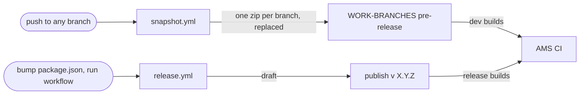

# CI and releases

How the panel gets built, packaged, and delivered to Ant Media Server. Everything runs on
GitHub Actions. You can build locally too, but real releases should come from CI.

The panel does not ship alone. One zip carries both panels: the legacy console at the web root
and this panel under `reborn-panel/`. AMS unzips it over `webapps/root`.

## How to release

Use CI. It builds from a clean checkout and stamps the exact commit, so the zip is reproducible.

1. Bump `version` in `package.json` (X.Y.Z), commit, push to master.
2. On GitHub: Actions > "Release (draft)" > Run workflow.
3. A draft release `v<version>` shows up under Releases, with `panel-release-<version>.zip`
   attached and auto-generated notes.
4. Edit the notes if you want, then hit Publish. That is when the git tag gets created.

There is no version field to type. The workflow reads the version from `package.json`, so the
zip name, the tag, and the build stamp can never disagree.

## The two channels

- **Versioned releases** (`v X.Y.Z`): cut by hand, steps above. AMS release builds pull these.
- **Branch snapshots** (`WORK-BRANCHES`): one long-lived pre-release holding one
  `panel-<slug>.zip` per branch, replaced in place on every push. AMS dev builds pull these.



## Branch snapshots

`snapshot.yml` runs on every push to every branch. It builds the full combined zip and uploads
it to the `WORK-BRANCHES` pre-release, overwriting that branch's previous zip. So the download
URL for a branch never changes:

```
https://github.com/ant-media/management-panel-reborn/releases/download/WORK-BRANCHES/panel-<slug>.zip
```

`slug` is the branch name with every character outside `[A-Za-z0-9._-]` turned into `-`. So
`feature/foo` becomes `panel-feature-foo.zip`, and master is `panel-master.zip`. A newer push
to the same branch cancels a still-running older build.

## Cleaning up old snapshots

Dead branches leave their zips behind. `cleanup.yml` handles that: run it by hand from the
Actions tab, pick an age (30/60/90/120 days, 120 default), and it deletes every `panel-*.zip`
on `WORK-BRANCHES` not updated in that long. `panel-master.zip` is never deleted.

## What's in the zip

Content-only, so it unzips straight over the server's `webapps/root`:

```
panel-release-<version>.zip
├── index.html, *.js, ...     legacy console (web root)
├── reborn-panel/             this panel
└── version.json              build stamp, CI only, do not deploy
```

Deploy by hand:

```bash
unzip -o panel-release-<version>.zip -x version.json -d <AMS>/webapps/root
```

## The build stamp

Every build carries a stamp: version, channel (DEV / SNAPSHOT / RELEASE), commit, branch, build
time. It lives in two places:

- **`version.json` at the zip root.** For CI: AMS reads it from the zip to spot a stale snapshot.
  Excluded on deploy, so a running server never serves it.
- **Baked into the JS bundle** (`src/lib/panel-build.ts`), shown under Server Settings in the
  "Panel" row.

There is deliberately no HTTP endpoint for it: a self-hosted server should not hand a scanner
its exact version in one request.

## Building locally

`./release.sh` does what CI does: builds the legacy console (`build-legacy.sh`), builds this
panel, writes the stamp, zips both.

```bash
./release.sh                 # full combined zip
./release.sh --skip-legacy   # this panel only, no legacy console in the zip
OUT_ZIP=my.zip ./release.sh  # custom output name
```

The stamp fields can be overridden with env vars (`PANEL_CHANNEL`, `PANEL_COMMIT`,
`PANEL_BRANCH`, `PANEL_BUILT_AT`); CI sets them, local builds fall back to git. Needs
node >= 20.19, pnpm, git and zip; on NixOS the script runs everything through `nix-shell`
on its own.

## The AMS side

AMS CI downloads the zip at build time instead of building the panels itself. The branch-aware
fetch (an AMS build on branch X pulls the panel built from panel branch X, with fallbacks) is
still being wired up; until it lands, that plan lives in [CI-TODO.md](../CI-TODO.md).
